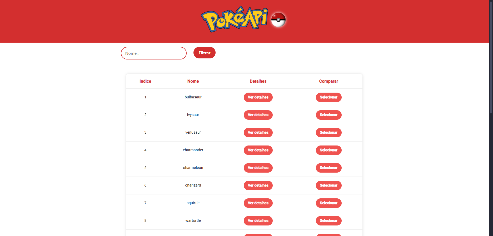
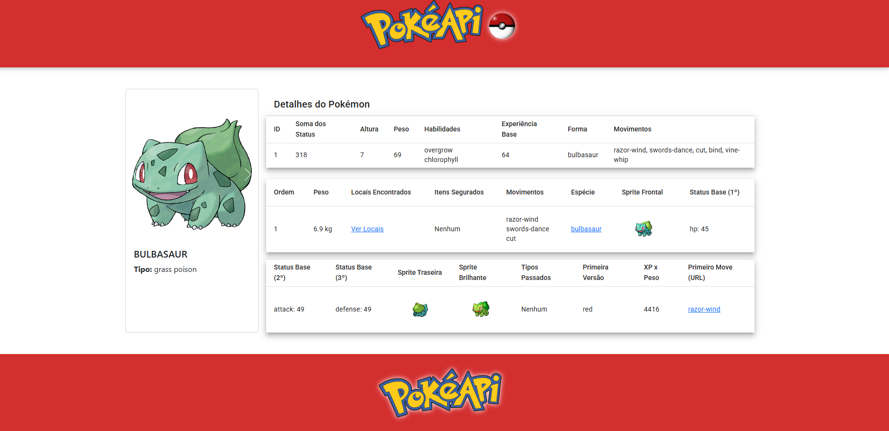
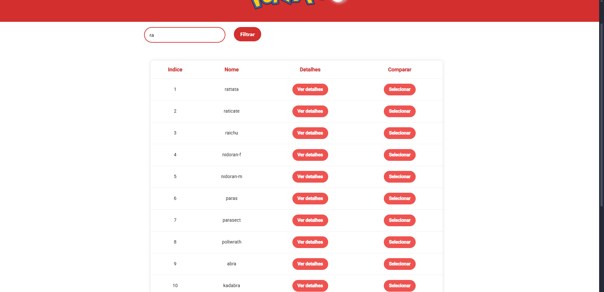

Projeto Pokémon
Este projeto foi desenvolvido como parte de um processo seletivo, onde a proposta era criar uma página web para consultar informações sobre Pokémons utilizando a API PokeAPI. O projeto permite visualizar uma lista de Pokémons, selecionar um para ver seus detalhes e realizar cálculos de soma de atributos dos Pokémons.

Funcionalidades
🔍 Consulta de Pokémons: A página exibe uma lista de Pokémons utilizando a API PokeAPI e permite que o usuário pesquise por um Pokémon específico.

📝 Detalhes de Pokémon: Ao selecionar um Pokémon da lista, o usuário pode ver informações detalhadas sobre ele, como tipo, habilidades e status.

➕ Soma dos Status: Ao visualizar os detalhes do Pokémon, a soma de todos os seus atributos base_stats é calculada e exibida.

⚔️ Comparação entre dois Pokémons (Extra): O projeto permite selecionar dois Pokémons e comparar qual dos dois tem a maior soma de status.

Tecnologias Utilizadas
Frontend: Angular, TypeScript, HTML, CSS

API: PokeAPI (https://pokeapi.co/)

Ferramentas: Angular CLI, npm

Tela Principal

  

Tela de Detalhes do Pokémon

  

Tela de Comparação entre Dois Pokémons

  

Funcionalidade de Pesquisa
O projeto permite que os usuários pesquisem por um Pokémon específico, digitando o nome ou parte do nome do Pokémon na barra de pesquisa.

  

